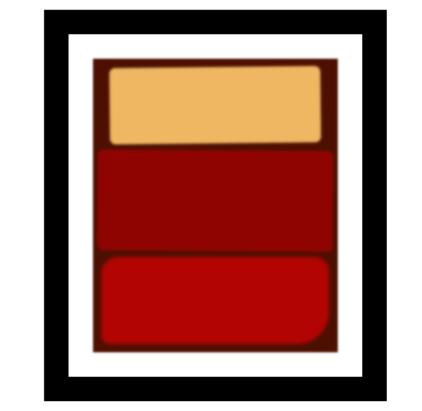

# FCC ROTHKO PAINTING

> A rothko painting is a form of rectangular art build by HTML element, CSS properties and Box Model.



Additional description of the project and its features.

## Built With

- HTML5 form element
  `html`. `div.frame`, `div.canvas`, `div.one`, `div.two`, `div.three`.
- CSS properties.
  `wildth`, `padding`, `marging`, `Box-shadow`, `border-radius`, `transform`,
  `filter`, `Over-flow` etc.

## Live Demo

[Live Demo Link](https://livedemo.com)

### Development (Running locally)

- Clone the project

```bash
git clone git@github.com:olayinka-oladele/06-fcc-rothko-painting.git

```

- Install Dependencies

```bash
yarn install
```

To run StyleLint by itself, you may run the lint task:

```bash
yarn lint:check
```

Or to automatically fix issues found (where possible):

```bash
yarn lint
```

You can also check against Prettier:

```bash
yarn format:check
```

and to have it fix (to the best of its ability) any format issues, run:

```bash
yarn format
```

You can also check against Webhint:

```bash
yarn hint
```

## Style Guides

- [CSS Style Guide](http://udacity.github.io/frontend-nanodegree-styleguide/css.html)
- [HTML Style Guide](http://udacity.github.io/frontend-nanodegree-styleguide/index.html)
- [Git Style Guide](https://udacity.github.io/git-styleguide/)

## 👤 Author

- Github: [@olayinka-oladele](https://github.com/olayinka-oladele)
- Freecodecamp: [@olayinka-oladele](https://freecodecamp.com/author)
- Linkedin: [@olayinka-oladele](https://www.linkedin.com/in/author/)

## 🤝 Contributing

Contributions, issues and feature requests are welcome!

Feel free to check the [issues page](../../issues).

## Show your support

Give a ⭐️ if you like this project!

## Acknowledgments

- FreeCodeCamp: [@fcc-rothko-painting](https://www.freecodecamp.org/learn/2022/responsive-web-design/learn-the-css-box-model-by-building-a-rothko-painting/step-45)

## 📝 License

[MIT licensed](./LICENSE).
